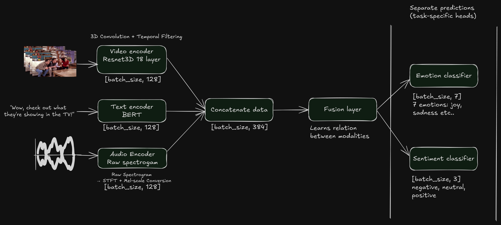

# 🧠 NeuroSense: Multimodal Sentiment & Emotion Classifier


**Decode human emotion and sentiment from video, audio, and text—at scale, in real-time, and with research-grade accuracy.**

---

## 📖 Overview

**NeuroSense** is a next-generation multimodal AI framework that fuses video, audio, and text to recognize emotions and sentiments in human communication. Designed for research, real-world deployment, and SaaS applications, NeuroSense combines the power of deep learning, cloud scalability, and a modern web interface.

---

## 🚀 Features

- 🎥 **Video Frame Analysis** — Extracts facial and contextual cues using ResNet3D.
- 🎙️ **Audio Feature Extraction** — Captures vocal emotion with Mel spectrograms and CNNs.
- 📝 **Text Embeddings with BERT** — Understands semantic sentiment from transcripts.
- 🔗 **Multimodal Fusion** — Late fusion of 128D features from each modality for robust affect detection.
- 📊 **Dual Head Classification** — Simultaneous prediction of 7 emotion classes and 3 sentiment classes.
- 🧪 **Model Training & Evaluation** — Efficient PyTorch pipeline with TensorBoard logging.
- ☁️ **Scalable Cloud Deployment** — AWS SageMaker for training, S3 for data, and real-time inference endpoints.
- 🔐 **Authentication & API Keys** — Auth.js and secure key management for SaaS users.
- 📈 **Usage Quota Tracking** — Monitor and limit API usage per user.
- 🌐 **Modern Frontend** — Next.js, Tailwind CSS, and T3 Stack for a seamless user experience.
- 🖼️ **Rich Visualizations** — Confusion matrices, training curves, and interactive analytics.

---

## 🏗️ Model Architecture

```
Video Frames ─┐
              │
         [ResNet3D]──┐
Text ─────[BERT]─────┼─► [Fusion Layer] ──► [Emotion Classifier] ─► 7 Emotions
              │      │                    └─► [Sentiment Classifier] ─► 3 Sentiments
Audio ──[CNN+Mel]────┘
```



### Key Components

- **Input Modalities**: Video frames, audio clips, and text transcripts
- **Feature Extraction**:
  - Video: ResNet3D processes frames to extract spatial-temporal features.
  - Audio: CNN processes Mel spectrograms for vocal emotion.
  - Text: BERT generates contextual embeddings from transcripts.
- **Fusion Layer**: Concatenates features from all modalities into a unified representation.
- **Classification Heads**:
  - Emotion Classifier: 7-way softmax for emotions (e.g., happy, sad, angry).
  - Sentiment Classifier: 3-way softmax for sentiment (positive, negative, neutral).
- **Output**: Real-time predictions for both emotion and sentiment.

### Model Details

- **Encoders**: BERT (text), ResNet3D (video), CNN (audio)
- **Fusion**: Concatenates 128D features from each encoder (total 384D), then projects to 256D
- **Heads**: Two classifiers for emotion (7-way) and sentiment (3-way)

---

## 🛠️ Tech Stack

| Layer         | Technologies                                                                 |
| ------------- | ---------------------------------------------------------------------------- |
| **AI/ML**     | PyTorch, HuggingFace Transformers (BERT), TorchVision (ResNet3D), torchaudio |
| **Cloud**     | AWS SageMaker, S3, IAM, CloudWatch, Docker                                   |
| **Web**       | Next.js, React, Tailwind CSS, tRPC, Prisma, Auth.js                          |
| **Dev Tools** | TensorBoard, Matplotlib, Seaborn, Docker                                     |

---

## 📦 Installation & Setup

### 1. Clone the Repository

```bash
git clone https://github.com/yourusername/neurosense.git
cd neurosense
```

### 2. Install Python Dependencies

```bash
pip install -r requirements.txt
```

### 3. Install Frontend Dependencies

```bash
cd frontend
npm install
cd ..
```

### 4. Prepare Dataset

- Download the [MELD Dataset](https://affective-meld.github.io)
- Extract and place it in the `data/` directory as follows:
  ```
  data/
    ├── train_splits/
    ├── test_splits/
    └── dev_splits/
  ```

---

## 🧠 Model Training (Local or SageMaker)

### Local Training

```bash
python train.py --model-dir ./output --epochs 25 --data-dir ./data
```

### AWS SageMaker Training

1. **Increase Quota** for your desired instance type (e.g., `ml.g5.xlarge`).
2. **Upload Dataset** to your S3 bucket:
   ```bash
   aws s3 sync ./data s3://your-bucket/data
   ```
3. **Create IAM Role** with S3 and SageMaker permissions.
4. **Start Training Job**:
   ```bash
   python train_sagemaker.py --role-arn
   ```

---

## 🛰️ Model Deployment

1. **Upload Model Artifacts** to your S3 bucket after training.
2. **Deploy Endpoint**:
   ```bash
   python deploy_endpoint.py --model-s3-uri s3://your-bucket/model.tar.gz
   ```
3. **Configure IAM for Inference** (see `deployment/README.md` for details).

---

## 📞 Inference API

- **REST API**: Real-time predictions via SageMaker endpoint.
- **API Key Management**: Secure access for frontend and external clients.
- **Example Usage**:
  ```python
  import requests
  response = requests.post(
      "https://api.neurosense.app/infer",
      headers={"x-api-key": ""},
      files={"video": open("sample.mp4", "rb")}
  )
  print(response.json())
  ```

---

## 📊 TensorBoard & Visualization

- **Training Metrics**:
  ```bash
  tensorboard --logdir output/tensorboard
  ```
- **Confusion Matrices & Curves**:
  Check `output/` or `results/` for PNGs and CSVs.

---

## 🖥️ Frontend Web App

**NeuroSense** includes a modern SaaS dashboard built with **Next.js** and **Tailwind CSS**.

### **Frontend Features**

- 🎬 **Media Upload**: Drag-and-drop video/audio files
- 📝 **Text Input**: Paste or type transcript for analysis
- ⚡ **Real-Time Inference**: See emotion & sentiment predictions instantly
- 📈 **Interactive Visualizations**: Explore confusion matrices, training curves, and usage analytics
- 🔑 **Authentication**: Secure sign-in with Auth.js (Google, GitHub, etc.)
- 📊 **Usage Dashboard**: Track API calls and quota per user
- 🛡️ **API Key Management**: Generate and manage API keys for secure access

### **Run the Frontend Locally**

```bash
cd frontend
npm run dev
# Visit http://localhost:3000
```

---

## 📊 Example Results

| Modality             | Emotion Accuracy | Sentiment F1 |
| -------------------- | ---------------- | ------------ |
| Video + Audio + Text | 0.82             | 0.87         |

- **Confusion matrices** and **classification reports** are auto-generated and saved for every evaluation.

---

## 🌐 Applications

- **Conversational AI**: Enhance chatbots and virtual assistants with emotional intelligence
- **Customer Experience**: Analyze emotions in support calls and video chats
- **Content Moderation**: Detect toxic or harmful sentiments in user-generated content
- **Mental Health**: Monitor mood and affect in telehealth sessions
- **Education**: Track student engagement and sentiment in e-learning

---

## 💡 Inspiration

NeuroSense is built to demonstrate the full lifecycle of a multimodal AI application—from deep learning model training, to scalable cloud deployment, to a beautiful SaaS web interface. It’s ideal for researchers, engineers, and product teams exploring the future of affective computing.

---

## 📬 Contributions

Pull requests are welcome! For major changes, please open an issue first to discuss what you would like to change.

---

## 📄 License

[MIT](LICENSE)

---

## ⭐️ Give NeuroSense a Star!

If you find this project useful or inspiring, please consider starring the repo and sharing it with your network!

---

**Decode the unspoken. Understand the unseen. Welcome to the future of emotion-aware AI.**

---
